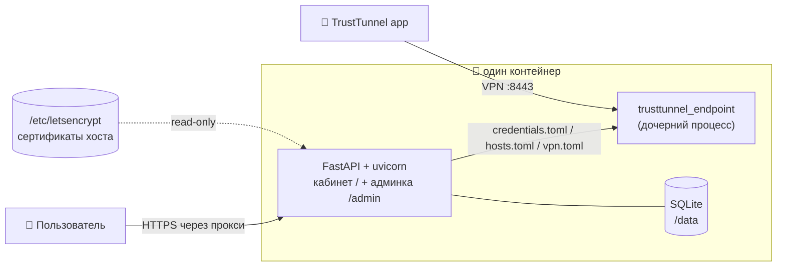

<div align="center">

# 🛡️ trusttunnel-web

**Минималистичная self-hosted панель для [TrustTunnel](https://github.com/TrustTunnel/TrustTunnel) — в одном Docker-контейнере.**

Панель + сам VPN-endpoint в одном образе. Без тарифов, баланса, биллинга и нод —
зашёл, создал конфиг, скачал, подключился.

[](https://github.com/Ttolyanich/trusttunnel-web/actions/workflows/build.yml)


</div>

---

## Что это

`trusttunnel-web` — предельно простая панель управления VPN на базе официального
`trusttunnel_endpoint`. Один контейнер поднимает **и веб-интерфейс, и сам VPN-сервер**;
панель управляет пользователями и их конфигами, а «под капотом» перегенерирует
`credentials.toml` / `hosts.toml` / `vpn.toml` и перезапускает endpoint.

- 👤 **Клиентский кабинет** (`/`) — вход/регистрация, **сброс пароля по e-mail**, создание конфигов, копирование полей и скачивание файлов, ссылки на **приложения TrustTunnel** (iOS/Android/PC).
- 🔧 **Админка** (`/admin`) — управление пользователями, их конфигами, настройками и **учетными записями администраторов** (создание, удаление, смена паролей в веб-интерфейсе).
- 🔐 **Гибкие сертификаты** — Let's Encrypt автоматически **или** готовые сертификаты
  из смонтированного каталога (когда панель за nginx/Caddy).
- 🕵️ **Маскировка** — подключение можно спрятать за отдельным доменом (SNI), отличным
  от домена панели.
- 📦 **Один контейнер** — SQLite, ноль внешних сервисов.

## Архитектура



## Быстрый старт

```bash
git clone https://github.com/Ttolyanich/trusttunnel-web.git
cd trusttunnel-web
cp .env.example .env          # задайте ADMIN_EMAIL / ADMIN_PASSWORD
docker compose up --build -d
```

- Кабинет: `http://<host>:8000/` · Админка: `http://<host>:8000/admin`
- Войдите в админку под `ADMIN_EMAIL` / `ADMIN_PASSWORD`, откройте **Настройки**,
  задайте домен подключения и сертификат — endpoint поднимется на `:8443`.

## Управление администраторами

Управлять администраторами можно двумя способами:
1. **В веб-панели**: в разделе **«Админы»** (`/admin/admins`) суперадминистратор может добавлять новые аккаунты, изменять логин, пароль и почту восстановления или удалять админов.
2. **Через CLI-скрипт**: если панель остановлена или вам нужно сбросить пароль из терминала, используйте встроенный скрипт на хост-машине:
   ```bash
   # Показать список всех администраторов
   /opt/trusttunnel-web/.venv/bin/python scripts/manage_admins.py --db /opt/trusttunnel-web/data/trusttunnel-web.db list

   # Создать администратора (логин, пароль, опционально почта восстановления)
   /opt/trusttunnel-web/.venv/bin/python scripts/manage_admins.py --db /opt/trusttunnel-web/data/trusttunnel-web.db create admin_login "пароль" --recovery-email "admin@example.com"
   ```

## Сертификаты: два режима

Режим выбирается в **Настройки → Домены и сертификаты**. Сертификат нужен endpoint'у —
именно за этим доменом «прячется» VPN-подключение.

| Режим | Когда | Как работает |
|-------|-------|--------------|
| **external** (по умолчанию) | Панель за nginx/Caddy, сертификаты уже есть на хосте | Панель **не выпускает** сертификаты, а сканирует `CERT_DIR/live/<домен>/` и предлагает выбрать домен подключения из готовых. Каталог монтируется с хоста (`:ro`). Продление подхватывается автоматически (SIGHUP endpoint). |
| **letsencrypt** | Контейнер смотрит в интернет напрямую (порты 80/443) | Панель сама выпускает и продлевает сертификат через `certbot` (standalone) в общий каталог. Требует проброс порта 80. |

**Тумблер «прятать подключение за отдельным доменом»**: если выключен — endpoint
использует домен панели; если включён — отдельный домен (домен B), и DPI видит именно его.

## Настройки (админка)

| Настройка | Описание |
|-----------|----------|
| Название панели | Заголовок в интерфейсе |
| Домен панели | Домен, за которым живёт кабинет/админка |
| Режим сертификатов | `external` / `letsencrypt` (см. выше) |
| Прятать подключение | Использовать отдельный домен для VPN |
| Домен подключения | Домен из сертификата endpoint'а (SNI) |
| Адрес / порт / SNI / протокол | Параметры, которые видит клиент |
| Показывать поля | Какие поля отображать в кабинете |
| Открытая регистрация | Разрешить самостоятельную регистрацию |
| SMTP | Хост/порт/логин/пароль/шифрование для писем сброса пароля (опционально) |
| Публичный URL панели | Базовый адрес для ссылок в письмах сброса |

> Сброс пароля работает и без SMTP: письмо просто не отправляется, а администратор
> всегда может задать пользователю новый пароль вручную из карточки пользователя.

## Как подключается пользователь

Официальное приложение TrustTunnel использует **ручной ввод полей** (не deeplink).
В кабинете каждый конфиг показывает: адрес, порт, домен (SNI), логин, пароль, протокол —
с кнопкой копирования и кнопкой **Скачать** (`.txt`/`.json`, плюс `tt://`-deeplink для QR).

## Переменные окружения

| Переменная | По умолчанию | Назначение |
|-----------|--------------|------------|
| `ADMIN_EMAIL` | `admin@example.com` | Bootstrap-админ (первый старт) |
| `ADMIN_PASSWORD` | `admin12345` | Пароль bootstrap-админа |
| `CERT_DIR` | `/etc/letsencrypt` | Каталог сертификатов |
| `PUBLIC_ADDRESS` | — | Адрес сервера по умолчанию |
| `SECRET_KEY` | авто | Ключ подписи сессий (иначе хранится в `/data`) |
| `DATA_DIR` | `/data` | Каталог данных (SQLite) |

## Миграция из trusttunnel-panel

Экспортируйте пользователей и конфиги в JSON и импортируйте:

```bash
python scripts/import_data.py --db /data/trusttunnel-web.db --input export.json
```

Argon2-хеши паролей и креды конфигов (`tt_username`/`tt_password`) переносятся один в один —
клиентам достаточно поменять домен подключения. Формат JSON описан в шапке скрипта.

## Технологии

FastAPI · Jinja2 · SQLite (stdlib `sqlite3`, WAL) · argon2 · PyJWT · uvicorn.
Никаких внешних БД и сервисов.

## Лицензия

Код — [MIT](LICENSE). Бинарь `trusttunnel_endpoint` скачивается из официальных релизов
TrustTunnel и распространяется на условиях **его собственной лицензии**.
