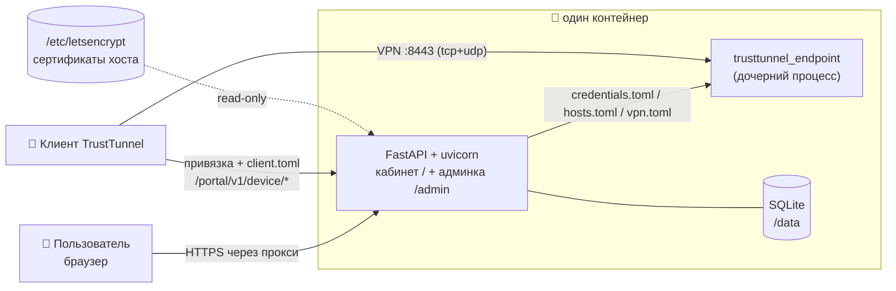

<div align="center">

# 🛡️ trusttunnel-web

**Минималистичная self-hosted панель для [TrustTunnel](https://github.com/TrustTunnel/TrustTunnel) — в одном Docker-контейнере.**

Панель + сам VPN-endpoint в одном образе. Без тарифов, баланса, биллинга и нод —
зашёл, создал конфиг, скачал, подключился.

[](https://github.com/Ttolyanich/trusttunnel-web/actions/workflows/build.yml)


</div>

---

## Что это

`trusttunnel-web` — предельно простая панель управления VPN на базе официального
`trusttunnel_endpoint`. Один контейнер поднимает **и веб-интерфейс, и сам VPN-сервер**;
панель управляет пользователями и их конфигами, а «под капотом» перегенерирует
`credentials.toml` / `hosts.toml` / `vpn.toml` и перезапускает endpoint.

- 👤 **Клиентский кабинет** (`/`) — вход/регистрация, **сброс пароля по e-mail**, создание конфигов, копирование полей и скачивание файлов.
- 📲 **Свои приложения** (Windows / Android) — скачиваются прямо из кабинета и настраиваются сами: **привязка устройства по QR**, адрес сервера вписывать не нужно (см. ниже).
- 🔧 **Админка** (`/admin`) — управление пользователями, их конфигами, настройками и **учетными записями администраторов** (создание, удаление, смена паролей в веб-интерфейсе).
- 🔐 **Гибкие сертификаты** — Let's Encrypt автоматически **или** готовые сертификаты
  из смонтированного каталога (когда панель за nginx/Caddy).
- 🕵️ **Маскировка** — подключение можно спрятать за отдельным доменом (SNI), отличным
  от домена панели.
- 📦 **Один контейнер** — SQLite, ноль внешних сервисов.

## Оглавление

[Архитектура](#архитектура) · [Быстрый старт](#быстрый-старт) ·
[За обратным прокси](#за-обратным-прокси) · [Администраторы](#управление-администраторами) ·
[Регистрация](#регистрация-пользователей) · [Сертификаты](#сертификаты-два-режима) ·
[Настройки](#настройки-админка) · [Как подключается пользователь](#как-подключается-пользователь) ·
[Контракт устройства](#контракт-устройства-для-своих-клиентов) ·
[Переменные окружения](#переменные-окружения) · [Обновление](#обновление) ·
[Бэкап](#бэкап) · [Диагностика](#диагностика) · [Миграция](#миграция-из-trusttunnel-panel)

## Архитектура


```mermaid
flowchart LR
    subgraph C["🐳 один контейнер"]
        W["FastAPI + uvicorn<br/>кабинет / + админка /admin"]
        E["trusttunnel_endpoint<br/>(дочерний процесс)"]
        DB[("SQLite<br/>/data")]
        W -- "credentials.toml / hosts.toml / vpn.toml" --> E
        W --- DB
    end
    U["👤 Пользователь<br/>браузер"] -->|HTTPS через прокси| W
    Cl["📱 Клиент TrustTunnel"] -->|"привязка + client.toml<br/>/portal/v1/device/*"| W
    Cl -->|"VPN :8443 (tcp+udp)"| E
    Certs[("/etc/letsencrypt<br/>сертификаты хоста")] -. read-only .-> W
```

## Быстрый старт

```bash
git clone https://github.com/Ttolyanich/trusttunnel-web.git
cd trusttunnel-web
cp .env.example .env          # задайте ADMIN_EMAIL / ADMIN_PASSWORD
docker compose up --build -d
```

- Кабинет: `http://<host>:8000/` · Админка: `http://<host>:8000/admin`
- Войдите в админку под `ADMIN_EMAIL` / `ADMIN_PASSWORD`, откройте **Настройки**,
  задайте домен подключения и сертификат — endpoint поднимется на `:8443`.

### Порты

| Порт | Кто ходит | Наружу? |
|---|---|---|
| `8000/tcp` | кабинет и админка | обычно **нет** — за обратным прокси |
| `8443/tcp+udp` | VPN-клиенты (QUIC/HTTP3 — udp обязателен) | **да** |
| `80/tcp` | certbot standalone | только в режиме `letsencrypt` |

### За обратным прокси

Панель почти всегда стоит за nginx/Caddy, а `:8443` торчит наружу напрямую.

```nginx
server {
    listen 443 ssl;
    server_name panel.example.com;
    ssl_certificate     /etc/letsencrypt/live/panel.example.com/fullchain.pem;
    ssl_certificate_key /etc/letsencrypt/live/panel.example.com/privkey.pem;

    location / {
        proxy_pass http://127.0.0.1:8000;
        proxy_set_header Host              $host;
        proxy_set_header X-Real-IP         $remote_addr;
        proxy_set_header X-Forwarded-For   $proxy_add_x_forwarded_for;
        proxy_set_header X-Forwarded-Proto $scheme;   # ← без него ссылки уйдут в http
    }
}
```

Контейнер запускает uvicorn с `--proxy-headers`, но заголовок должен приходить.
Иначе `request.base_url` вернёт `http://…`, и QR-привязка на телефоне упрётся в
редирект (ровно так и ловилась ошибка 301). Плюс задайте **Публичный URL панели**
в настройках — он важнее заголовков.

## Управление администраторами

Управлять администраторами можно двумя способами:

1. **В веб-панели** — раздел **«Админы»** (`/admin/admins`): добавить аккаунт,
   сменить логин, пароль или почту восстановления, удалить админа (кроме себя).
   Роль одна, отдельного «суперадмина» нет.
2. **Через CLI-скрипт** — когда в панель уже не войти. Скрипт лежит в образе,
   запускается внутри контейнера:
   ```bash
   # Показать список всех администраторов
   docker exec trusttunnel-web python scripts/manage_admins.py --db /data/trusttunnel-web.db list

   # Создать администратора (логин, пароль, опционально почта восстановления)
   docker exec trusttunnel-web python scripts/manage_admins.py --db /data/trusttunnel-web.db create admin_login "пароль" --recovery-email "admin@example.com"
   ```

## Регистрация пользователей

Тумблер **«Открытая регистрация»** в настройках включает форму `/register`. При
включённой регистрации:

- форма защищена простой математической капчей (`a + b`, ответ сверяется по хешу
  в cookie) — это анти-бот, а не защита от человека;
- новый пользователь создаётся со статусом **`pending`**: войти он не сможет
  («аккаунт ожидает подтверждения»), пока админ не нажмёт **«Одобрить и
  активировать»** в карточке пользователя;
- в `credentials.toml` попадают только конфиги пользователей со статусом `active` —
  `pending` и `blocked` VPN не получают.

Блокировка пользователя мгновенно выкидывает его креды из endpoint'а.

## Сертификаты: два режима

Режим выбирается в **Настройки → Домены и сертификаты**. Сертификат нужен endpoint'у —
именно за этим доменом «прячется» VPN-подключение.

| Режим | Когда | Как работает |
|-------|-------|--------------|
| **external** (по умолчанию) | Панель за nginx/Caddy, сертификаты уже есть на хосте | Панель **не выпускает** сертификаты, а сканирует `CERT_DIR/live/<домен>/` и предлагает выбрать домен подключения из готовых. Каталог монтируется с хоста (`:ro`). Продление подхватывается автоматически (SIGHUP endpoint). |
| **letsencrypt** | Контейнер смотрит в интернет напрямую (порты 80/443) | Панель сама выпускает и продлевает сертификат через `certbot` (standalone) в общий каталог. Требует проброс порта 80. |

**Тумблер «прятать подключение за отдельным доменом»**: если выключен — endpoint
использует домен панели; если включён — отдельный домен (домен B), и DPI видит именно его.

## Настройки (админка)

| Настройка | Описание |
|-----------|----------|
| Название панели | Заголовок в интерфейсе |
| Домен панели | Домен, за которым живёт кабинет/админка |
| Режим сертификатов | `external` / `letsencrypt` (см. выше) |
| Прятать подключение | Использовать отдельный домен для VPN |
| Домен подключения | Домен из сертификата endpoint'а (SNI) |
| Адрес / порт / SNI / протокол | Параметры, которые видит клиент |
| Показывать поля | Какие поля отображать в кабинете |
| Открытая регистрация | Разрешить самостоятельную регистрацию |
| SMTP | Хост/порт/логин/пароль/шифрование для писем сброса пароля (опционально) |
| Публичный URL панели | Базовый адрес для писем сброса, **QR-привязки и имени установщика** |

> Сброс пароля работает и без SMTP: письмо просто не отправляется, а администратор
> всегда может задать пользователю новый пароль вручную из карточки пользователя.

## Как подключается пользователь

### Наши приложения — без ручного ввода

Собираются из [trusttunnel-client](https://github.com/Ttolyanich/trusttunnel-client).
Панель их не собирает, а **раздаёт**: файлы кладутся в том `/data/downloads`, и
кнопки скачивания появляются в кабинете сами.

| Файл в `/data/downloads` | Кнопка в кабинете |
|---|---|
| `TrustTunnel-Setup.exe` | Скачать для Windows |
| `TrustTunnel.apk` | Скачать для Android (arm64) |
| `TrustTunnel-armv7.apk` | Сборка для armv7 (старые телефоны) |

Настройка не вводится руками ни на одной платформе:

- **Телефон** — «Подключить устройство по QR» в разделе «Мои устройства». Код
  одноразовый, живёт 3 минуты, приносит и адрес панели, и привязку. Если кабинет
  открыт на самом телефоне — кнопка «Подключить это устройство» (ссылка
  `ttsuperlink://`) или копирование ссылки в буфер. **Компьютер не нужен**, пароль
  от кабинета в приложение не вводится.
- **Windows** — вход через браузер, плюс адрес подставляется автоматически: файл
  отдаётся как `TrustTunnel-Setup_<хост>.exe`, установщик достаёт хост из имени.
  Одна сборка обслуживает любой сервер.

Привязанные устройства видны в кабинете и отзываются одной кнопкой (VPN у
отозванного перестаёт работать сразу).

> ⚠️ Для QR и для имени установщика нужен корректный публичный адрес: задайте
> **Публичный URL панели** в настройках админки. Иначе за обратным прокси
> `request.base_url` вернёт `http://…` и телефон уткнётся в редирект. Контейнер
> запускает uvicorn с `--proxy-headers` по той же причине.

### Официальные приложения — ручной ввод

Для iOS (и как альтернатива на других платформах) остаются приложения TrustTunnel:
в кабинете каждый конфиг показывает адрес, порт, домен (SNI), логин, пароль,
протокол — с кнопкой копирования и кнопкой **Скачать** (`.txt`/`.json`, плюс
`tt://`-deeplink для QR).

На desktop есть ещё [Trusty](https://github.com/Meddelin/trusty) — **сторонний**
GUI поверх официального CLI, только Windows и macOS. Linux-сборок ни у кого нет.

### Контракт устройства (для своих клиентов)

Всё, что нужно приложению, — шесть эндпоинтов (`app/routes_device.py`):

| Метод и путь | Что делает |
|---|---|
| `GET /connect?redirect_uri=…&state=…` | страница подтверждения устройства (desktop-вход) |
| `POST /connect/approve` | создаёт устройство, возвращает токен на `127.0.0.1` |
| `POST /portal/v1/device/enroll` | меняет одноразовый код из QR на device-токен |
| `GET /portal/v1/device/me` | проверка токена, кто это устройство |
| `GET /portal/v1/device/locations` | список локаций (здесь всегда одна) |
| `POST /portal/v1/device/connect` | выдаёт готовый `client.toml` |

Авторизация — заголовок `X-Device-Token`. `redirect_uri` в `/connect` принимается
**только loopback** — иначе токен можно было бы увести на чужой хост. Ответ
`enroll` не различает «нет кода» / «истёк» / «уже использован»: подбирающему незачем
знать, насколько он близок. При первом `connect` устройству автоматически заводится
свой конфиг (`u<id>-xxxx`), так что отзыв устройства не задевает остальные.

## Переменные окружения

| Переменная | По умолчанию | Назначение |
|-----------|--------------|------------|
| `ADMIN_EMAIL` | `admin@example.com` | Bootstrap-админ (первый старт) |
| `ADMIN_PASSWORD` | `admin12345` | Пароль bootstrap-админа |
| `CERT_DIR` | `/etc/letsencrypt` | Каталог сертификатов |
| `PUBLIC_ADDRESS` | — | Адрес сервера по умолчанию |
| `SECRET_KEY` | авто | Ключ подписи сессий (иначе хранится в `/data`) |
| `DATA_DIR` | `/data` | Каталог данных (SQLite) |
| `WIN_INSTALLER` | `/data/downloads/TrustTunnel-Setup.exe` | Установщик нашего Windows-приложения |
| `ANDROID_APK` | `/data/downloads/TrustTunnel.apk` | APK (arm64) |
| `ANDROID_APK_V7` | `/data/downloads/TrustTunnel-armv7.apk` | APK для armv7 |

## Обновление

CI собирает образ и публикует его в GHCR (`ghcr.io/ttolyanich/trusttunnel-web:latest`,
публичный — pull без логина). Прод рекомендуется держать на образе, а не на локальной
сборке: в `docker-compose.yml` вместо `build: .` указать `image: …`.

```bash
cd /opt/trusttunnel-web
docker compose pull && docker compose up -d
```

Миграции схемы выполняет сам `init_db` при старте — отдельного шага нет.
**Учтите:** пересоздание контейнера перезапускает endpoint, то есть рвёт активные
VPN-сессии на пару секунд. Клиенты переподключаются сами.

Файлы приложений в `/data/downloads` живут в томе и обновлением образа не
затрагиваются — заливаются отдельно:

```bash
scp TrustTunnel-Setup.exe root@<host>:/opt/trusttunnel-web/data/downloads/
```

## Бэкап

Всё состояние — в томе `/data`: SQLite-база, ключ подписи сессий, файлы приложений.

```bash
docker compose stop                      # или sqlite3 .backup на живой базе
tar czf ttweb-$(date +%F).tar.gz -C /opt/trusttunnel-web data
docker compose start
```

Восстановление — распаковать том обратно и поднять контейнер. Пароли пользователей
(argon2) и креды конфигов переносятся вместе с базой, клиентам ничего менять не надо.

## Диагностика

**Endpoint запущен?** Проверяйте **с хоста**, а не изнутри контейнера:

```bash
ss -lntup | grep 8443                    # должен быть и tcp, и udp
openssl s_client -connect <домен>:8443 -servername <домен> </dev/null | head
```

> ⚠️ `docker compose exec … python -c "…endpoint.manager.status()"` **всегда врёт**
> `running: False`. `exec` создаёт новый процесс и новый экземпляр менеджера, у
> которого нет дочернего процесса; настоящий endpoint — потомок uvicorn (pid 1).
> Верить можно только дашборду (тот же процесс) или проверке портов с хоста.

**Логи панели и endpoint'а** — в общем потоке контейнера:

```bash
docker compose logs -f --tail=200
```

**Клиент не подключается.** Порядок проверки: домен подключения и сертификат в
настройках → `credentials.toml` содержит нужного пользователя (статус `active`) →
`:8443` доступен снаружи по **udp** тоже (QUIC), иначе клиент будет молча
деградировать или падать по таймауту.

**QR не срабатывает / ошибка 301** — не задан «Публичный URL панели» либо прокси не
шлёт `X-Forwarded-Proto` (см. [За обратным прокси](#за-обратным-прокси)).

## Миграция из trusttunnel-panel

Экспортируйте пользователей и конфиги в JSON, положите файл в том и импортируйте
внутри контейнера:

```bash
cp export.json /opt/trusttunnel-web/data/
docker exec trusttunnel-web python scripts/import_data.py \
    --db /data/trusttunnel-web.db --input /data/export.json
```

Argon2-хеши паролей и креды конфигов (`tt_username`/`tt_password`) переносятся один в один —
клиентам достаточно поменять домен подключения. Формат JSON описан в шапке скрипта.

## Технологии

FastAPI · Jinja2 · SQLite (stdlib `sqlite3`, WAL) · argon2 · PyJWT · uvicorn.
Никаких внешних БД и сервисов.

## Лицензия

Код — [MIT](LICENSE). Бинарь `trusttunnel_endpoint` скачивается из официальных релизов
TrustTunnel и распространяется на условиях **его собственной лицензии**.
